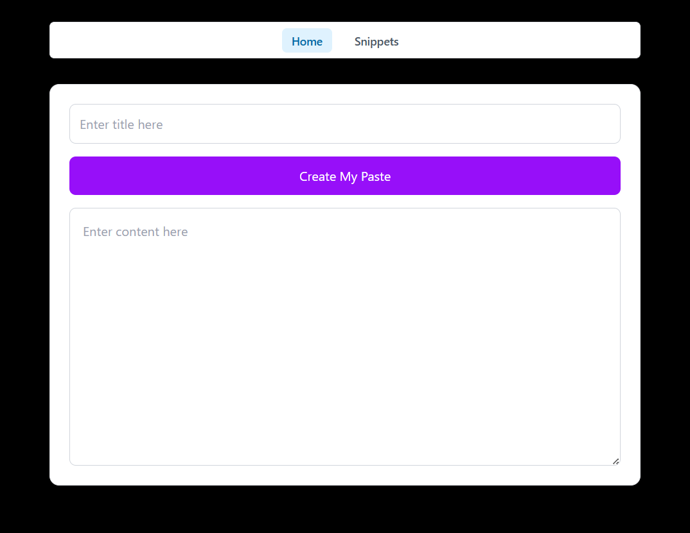
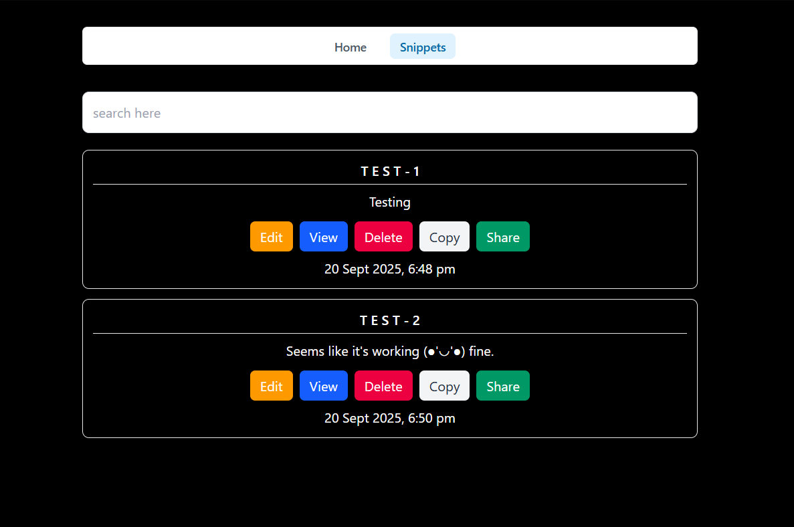

# Paste App

A tiny React app to practice basic CRUD, routing, Redux, and Tailwind. Pastes are saved in LocalStorage.

## Live
https://paste-app-six-fawn.vercel.app

## Stack
- Vite + React, React Router, Redux Toolkit
- Tailwind CSS, react-hot-toast

## Features
- Create, View, Edit, Delete pastes
- Search by title
- Shareable
- Toast feedback

## Screenshots
Place images in screenshots/ (same folder as this README).
- Home  
  
- All Pastes  
  

## Quick start
```
npm install
npm run dev
```
## What I learned
- React hooks (useState, useEffect)
- Routing with React Router
- State with Redux Toolkit (slices/actions)
- Tailwind utility styling
- JSON stringify/parse for localStorage
